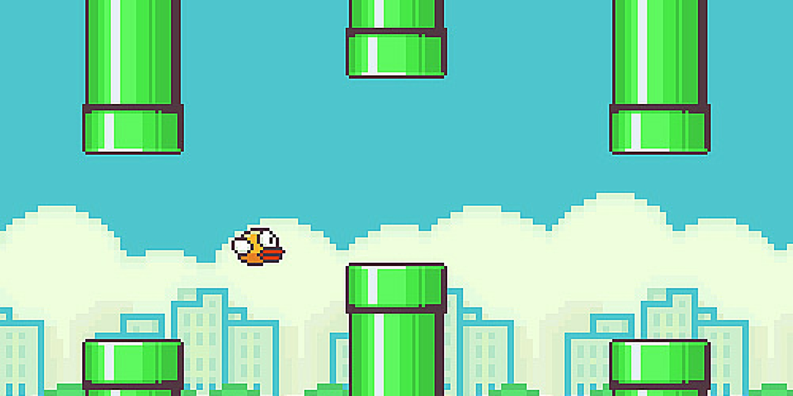

# Flappy Bird Game Clone

## Description

This is remake of the famous flappy bird game that took the world by storm in 2013.
The aim of the game is to fly the object through the gaps in the incoming columns without hitting them.

The users score is calculated with every game and their high score is updated when surpassed. I also coded the high score to persist, using local storage.

## Contributors
Takunda J Nyamatore
